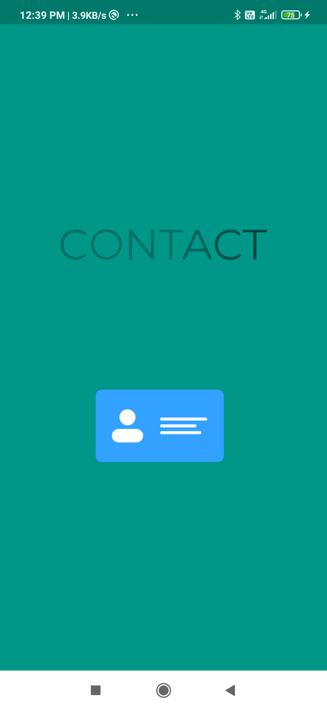

# ContantList Demo

Fetching Contacts from Device and shwoing three types of list like All Contacts, Favourites & Deleted Contacts. A Android project with Implementation of a Contacts app using RoomDatabase.
It consist some common operations like create, edit, delete operations on Contacts.


## Permissions

To run this project, you will need to allow peremission for fetch contacts.

`android.permission.READ_CONTACTS`

`android.permission.WRITE_CONTACTS`


## Installation
Clone this repository and import into **Android Studio**
```bash
git clone https://github.com/Mahikadu/ContactDemo.git
```

## Features Implemented
* Splash Screen with Lottie Animation
* Bottom Navigation
* Contacts List
* Favourites Contacts List
* Deleted Contacts List
* Contact Details
* Floating Button
* Light/dark mode toggle
* Fullscreen mode

  
## 🚀 About Me
  
# Hi, I'm Mahesh! 👋

I'm a Android developer...


## Screenshots

<div id="images" style="#images {
    white-space: nowrap;
}">



</div>
<br/>

<div id="images" style="#images {
    white-space: nowrap;
}">


</div>
<br/>


  
## Dependencies

- Implementing required dependency

### For RoomDatabase

`implementation 'androidx.room:room-runtime:2.2.5'`
`annotationProcessor 'androidx.room:room-compiler:2.2.5'`

### For Gson

`implementation 'com.google.code.gson:gson:2.8.7'`

### For Image Loading Glide

`implementation 'com.github.bumptech.glide:glide:4.11.0'`

### For Animation Lottie

`implementation 'com.airbnb.android:lottie:3.7.1'`


