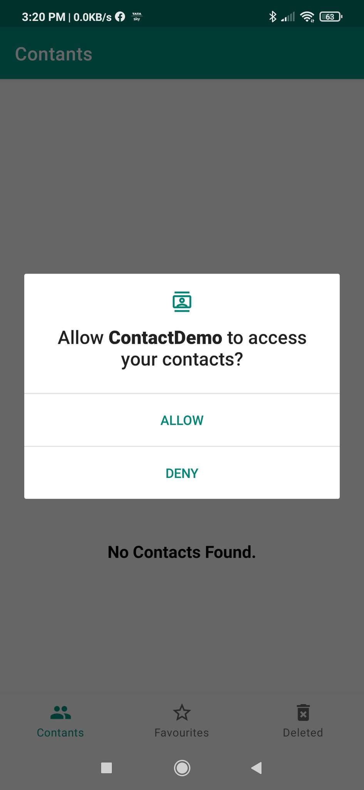
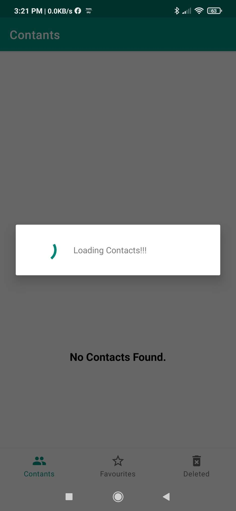
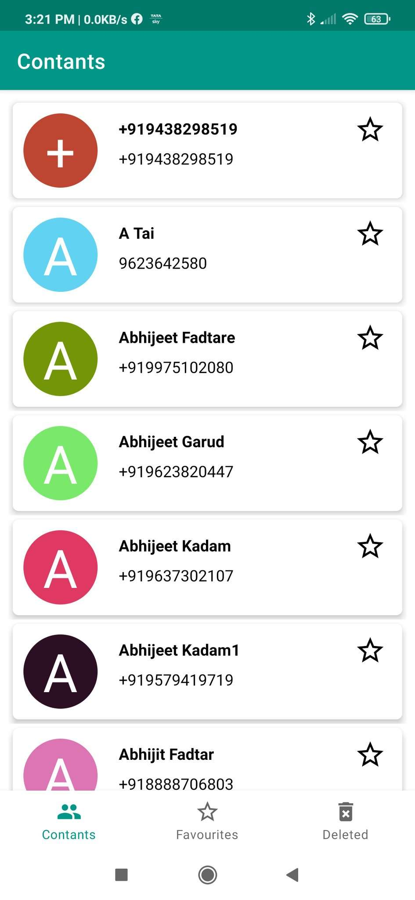
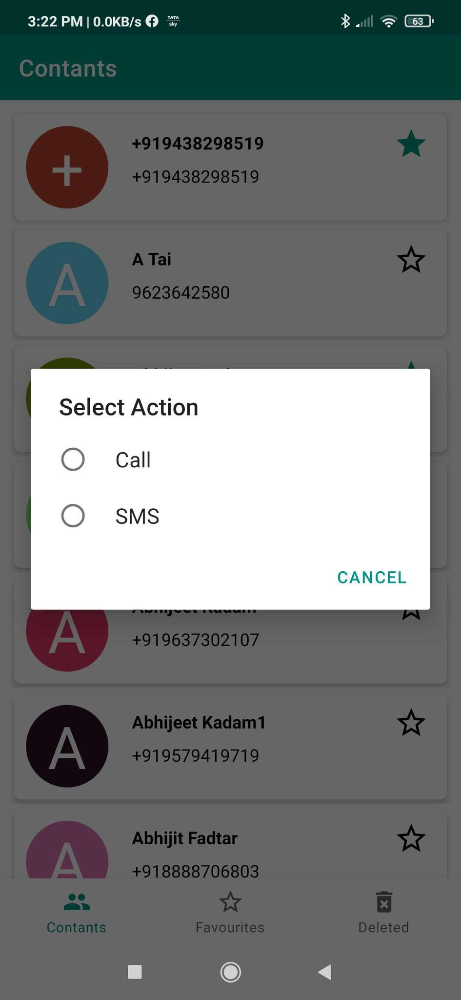
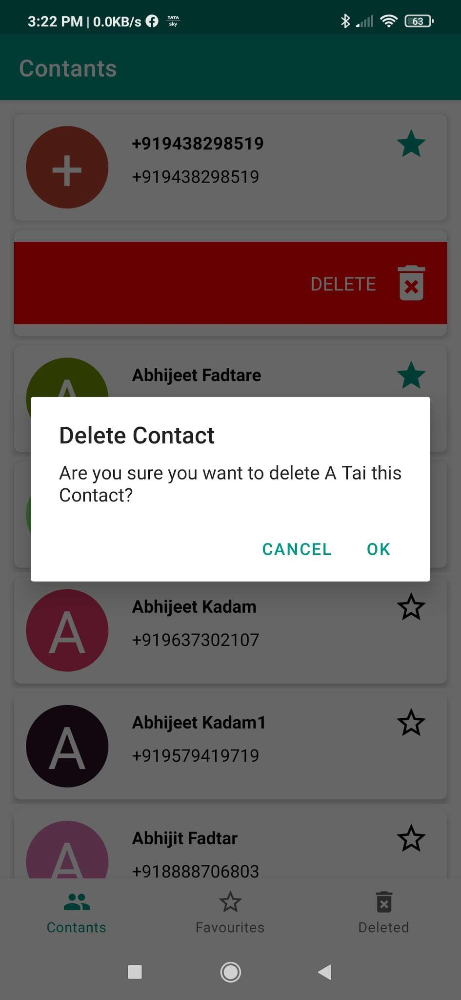
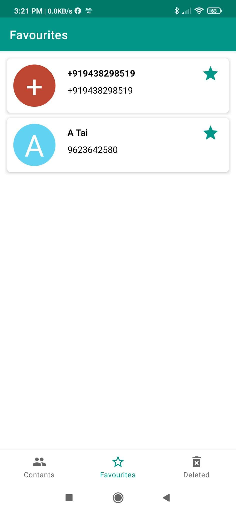
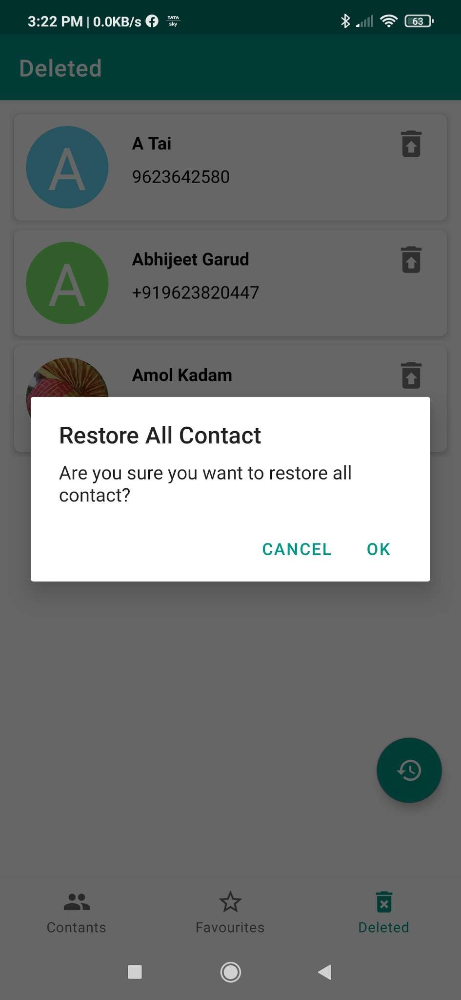

# ContantList Demo

Fetching Contacts from Device and shwoing three types of list like All Contacts, Favourites & Deleted Contacts. A Android project with Implementation of a Contacts app using RoomDatabase.
It consist some common operations like create, edit, delete operations on Contacts.


## Permissions

To run this project, you will need to allow peremission for fetch contacts.

`android.permission.READ_CONTACTS`

`android.permission.WRITE_CONTACTS`


## Installation
Clone this repository and import into **Android Studio**
```bash
git clone https://github.com/Mahikadu/ContactDemo.git
```

## Features Implemented
* Splash Screen with Lottie Animation
* Bottom Navigation
* Contacts List
* Favourites Contacts List
* Deleted Contacts List
* Contact Details
* Floating Button
* Light/dark mode toggle
* Fullscreen mode

  
## 🚀 About Me
  
# Hi, I'm Mahesh! 👋

I'm a Android developer...


## Screenshots

<div id="images" style="#images {
    white-space: nowrap;
}">




</div>
<br/>

<div id="images" style="#images {
    white-space: nowrap;
}">




</div>
<br/>


  
## Dependencies

- Implementing required dependency

### For RoomDatabase

`implementation 'androidx.room:room-runtime:2.2.5'`
`annotationProcessor 'androidx.room:room-compiler:2.2.5'`

### For Gson

`implementation 'com.google.code.gson:gson:2.8.7'`

### For Image Loading Glide

`implementation 'com.github.bumptech.glide:glide:4.11.0'`

### For Animation Lottie

`implementation 'com.airbnb.android:lottie:3.7.1'`


## How to use this App.

* Launch SplashScreen with Lottie Animation.

* On Home screen allow Contact permission for fetchng all the contacts available on device.

* Homescreen showing contact list using Bottom Navigation with three tab like Contacts, Favourites & Deleted.

* Fetched contact show on Contact tab in a list. All these data should be stored in a database. 

* Each row of list will contain the picture of contact person, his/her name & contact number. If any contact doesn’t have picture so it should show the first letter of contact name in place of picture. Along with these row will contain Favourite button. 

* On clicking on Favourite button the contact should be added as favourite. If contact is already added as Favourite so the button clicking should remove from favourites.

* Any row swap right to left show popup for ask conformation of delete contact. So click on 'OK' button contact will be deleted from list.

* Click on any row showing single choice popup for Call & SMS to contact. 

* Favourites screen showing all the contacts which are made favourite by user. This list should be same as Contacts screen’s list. 

* Deleted screen showing all the contacts which are deleted by user. This list should be same as Contacts screen’s list.

* Deleted screen showing contacts are restore individual or restore all on one single click using Floating Restore button.
* Launch SplashScreen with Lottie Animation.